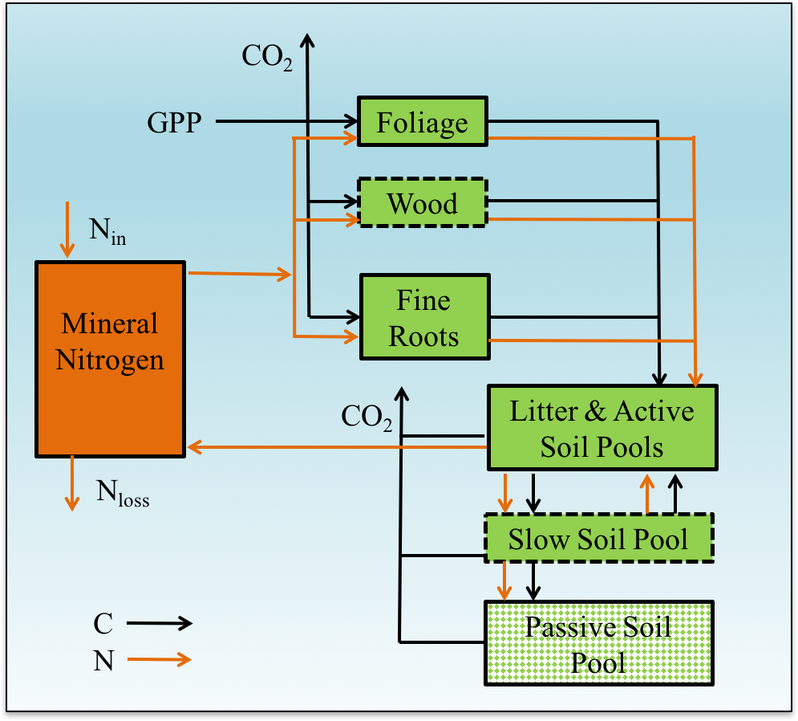

# QE framework
    
  This repository stores R codes for constructing the quasi-equilibrium (QE) framework, and for testing alternative model assumptions using this QE framework. 

  The quasi-equilibrium framework is developed by Comins and McMurtrie (1993) to analyzing long-term model response to alternative model assumptions. A pool of literature is available on this topic, as summarized in the **Key literatures** section. 

  Here, I am using this framework to evaluate several recently-incorporated model assumptions in determining the time-varying model response to elevated CO2. 

  The baseline model framework is the Generic Decomposition And Yield (GDAY) model, with simplified C-N interactions.

# Repository structure
  The **Run_programs.R** script is the master sheet that calls in all the functions, parameters, scripts to generate results. 
  The **QE_Functions** folder stores all the QE framework related functions. 
  The **QE_Scripts** folder stores all the QE related scripts that perform the analyses. 
  The **QE_Analyses** folder stores all the post-processing functions and scripts for output purposes. 
  The **Parameters** folder stores all the input parameters used in the QE framework. 
  The **Plots** folder stores all the output figures. 
  The **Tables** folder stores all the output tables. 
  The **R_Markdown** folder stores all the R markdown script. 

# Model framework

    
# Key literatures:
    
  Comins HN, McMurtrie RE. 1993. Long-term response of nutrient-limited forests to CO2 enrichment; equilibrium behavior of plant-soil models. Ecological Applications 3: 666-681.
  Comins HN. 1994. Equilibrium Analysis of Integrated Plant—Soil Models for Prediction of the Nutrient Limited Growth Response to CO2 Enrichment. Journal of Theoretical Biology 171(4): 369-385.
  Comins HN. 1997. Analysis of nutrient-cycling dynamics, for predicting sustainability and CO2-response of nutrient-limited forest ecosystems. Ecological Modelling 99(1): 51-69.
  Dewar RC. 1996. The correlation between plant growth and intercepted radiation: An interpretation in terms of optimal plant nitrogen content. Annals of Botany 78(1): 125-136.
  Dewar RC, McMurtrie RE. 1996. Analytical model of stemwood growth in relation to nitrogen supply. Tree Physiology 16(1-2): 161-171.
  Kirschbaum MUF, King DA, Comins HN, McMurtrie RE, Medlyn BE, Pongracic S, Murty D, Keith H, Raison RJ, Khanna PK, et al. 1994. Modeling forest response to increasing CO2 concentration under nutrient-limited conditions. Plant Cell and Environment 17(10): 1081-1099.
  Kirschbaum MUF, Medlyn BE, King DA, Pongracic S, Murty D, Keith H, Khanna PK, Snowdon P, Raison RJ. 1998. Modelling forest-growth response to increasing CO2 concentration in relation to various factors affecting nutrient supply. Global Change Biology 4(1): 23-41.
  McMurtrie R, Comins HN. 1996. The temporal response of forest ecosystems to doubled atmospheric CO2 concentration. Global Change Biology 2(1): 49-57.
  McMurtrie RE, Dewar RC, Medlyn BE, Jeffreys MP. 2000. Effects of elevated [CO2] on forest growth and carbon storage: a modelling analysis of the consequences of changes in litter quality/quantity and root exudation. Plant and Soil 224(1): 135-152.
  McMurtrie RE, Iversen CM, Dewar RC, Medlyn BE, Näsholm T, Pepper DA, Norby RJ. 2012. Plant root distributions and nitrogen uptake predicted by a hypothesis of optimal root foraging. Ecology and Evolution 2(6): 1235-1250.
  McMurtrie RE, Medlyn BE, Dewar RC. 2001. Increased understanding of nutrient immobilization in soil organic matter is critical for predicting the carbon sink strength of forest ecosystems over the next 100 years. Tree Physiology 21(12-13): 831-839.
  Medlyn BE, Dewar RC. 1996. A model of the long-term response of carbon allocation and productivity of forests to increased CO2 concentration and nitrogen deposition. Global Change Biology 2(4): 367-376.
  Medlyn BE, McMurtrie RE, Dewar RC, Jeffreys MP. 2000. Soil processes dominate the long-term response of forest net primary productivity to increased temperature and atmospheric CO2 concentration. Canadian Journal of Forest Research 30(6): 873-888.
  Murty D, McMurtrie RE, Ryan MG. 1996. Declining forest productivity in aging forest stands: A modeling analysis of alternative hypotheses. Tree Physiology 16(1-2): 187-200.
